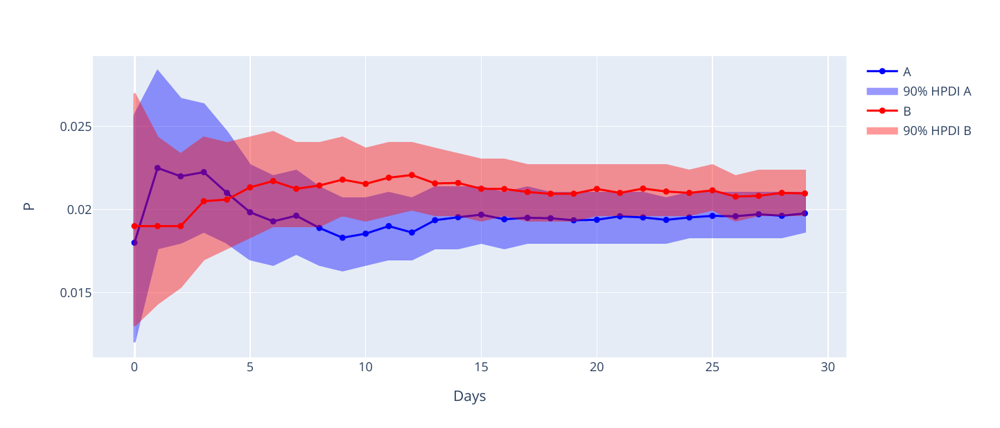

### Байесовский подход к оценке А/Б-тестов

    

При проведении А/Б-тестов в мобильных приложениях и веб-сервисах требуется ответить на вопросы:  

* Какой вариант лучше и насколько?   
* Каковы оценки целевой метрики в каждом варианте?   
* Насколько уверены в оценке?  
* Сколько должен продолжаться эксперимент?   

На отдельных примерах показано, как ответить на вопросы выше с помощью байесовского моделирования.

**Содержание:**

1. [Общие идеи и сравнение конверсий](https://nbviewer.org/github/noooway/Bayesian-Modelling-for-AB-Testing/blob/main/1-%D0%9E%D0%B1%D1%89%D0%B8%D0%B5%20%D0%B8%D0%B4%D0%B5%D0%B8.ipynb)
2. [Сравнение средних](https://nbviewer.org/github/noooway/Bayesian-Modelling-for-AB-Testing/blob/main/2-%D0%A1%D1%80%D0%B0%D0%B2%D0%BD%D0%B5%D0%BD%D0%B8%D0%B5%20%D1%81%D1%80%D0%B5%D0%B4%D0%BD%D0%B8%D1%85.ipynb)  
3. [Приложение: проверка статистических гипотез](https://nbviewer.org/github/noooway/Bayesian-Modelling-for-AB-Testing/blob/main/%D0%9F%D1%80%D0%B8%D0%BB%D0%BE%D0%B6%D0%B5%D0%BD%D0%B8%D0%B5-%D0%9F%D1%80%D0%BE%D0%B2%D0%B5%D1%80%D0%BA%D0%B0_%D1%81%D1%82%D0%B0%D1%82%D0%B8%D1%81%D1%82%D0%B8%D1%87%D0%B5%D1%81%D0%BA%D0%B8%D1%85_%D0%B3%D0%B8%D0%BF%D0%BE%D1%82%D0%B5%D0%B7.ipynb)  

**Черновики:**

[Приложение: сравнение методов оценки А/Б-тестов](https://github.com/noooway/Bayesian-Modelling-for-AB-Testing/blob/main/%D0%9F%D1%80%D0%B8%D0%BB%D0%BE%D0%B6%D0%B5%D0%BD%D0%B8%D0%B5-%D0%A1%D1%80%D0%B0%D0%B2%D0%BD%D0%B5%D0%BD%D0%B8%D0%B5_%D0%BC%D0%B5%D1%82%D0%BE%D0%B4%D0%BE%D0%B2_%D0%BE%D1%86%D0%B5%D0%BD%D0%BA%D0%B8_%D0%90%D0%91_%D1%82%D0%B5%D1%81%D1%82%D0%BE%D0%B2.ipynb)    
[Приложение: множественные сравнения](https://github.com/noooway/Bayesian-Modelling-for-AB-Testing/blob/main/%D0%9F%D1%80%D0%B8%D0%BB%D0%BE%D0%B6%D0%B5%D0%BD%D0%B8%D0%B5-%D0%9C%D0%BD%D0%BE%D0%B6%D0%B5%D1%81%D1%82%D0%B2%D0%B5%D0%BD%D0%BD%D1%8B%D0%B5_%D1%81%D1%80%D0%B0%D0%B2%D0%BD%D0%B5%D0%BD%D0%B8%D1%8F.ipynb)  

